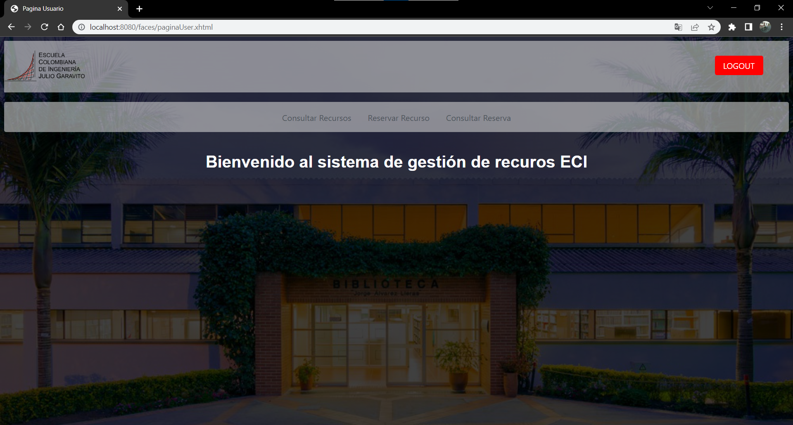

# 2022-1-PROYCVDS-CICLAS

## Nombre del proyecto
### _**2022-1-PROYCVDS-CICLAS**_

## Período académico
### _2022-1_
## Nombre del curso
### _CVDS-1_
## Nombre de los integrantes
* ### YESID SANTIAGO CARRILLO ALMEIDA
* ### EDGAR RONALDO HENAO VILLARREAL
* ### SANTIAGO MIGUEL FETECUA SUÁREZ
* ### EDWAR FABIAN LOZANO FLOREZ
* ### CARLOS ALBERTO SORZA GÓMEZ
## Nombre del profesor
### JULIAN MAURICIO VELASCO BRICEÑO
## Roles asignados
* ### YESID SANTIAGO CARRILLO ALMEIDA: ***Back***
* ### EDGAR RONALDO HENAO VILLARREAL: ***Back***
* ### SANTIAGO MIGUEL FETECUA SUÁREZ:  ***Front***
* ### EDWAR FABIAN LOZANO FLOREZ: ***Front***
* ### CARLOS ALBERTO SORZA GÓMEZ ***Back***
* ### JULIAN MAURICIO VELASCO BRICEÑO: ***Dueño del producto***
* ### SANTIAGO AGUSTIN LAITON CUBIDES: ***Dueño del producto***

## Imagenes del producto.

Las siguientes imagenes muestran el funcionamiento del producto.

- Inicio de sesión a la pagina:

- Administrador

- Usuario

- consultarRecurso

- crearRecurso

- cambiarEstado

- reservarRecurso

- consultarReserva

## Arquitectura y Diseño detallado:
1. Modelo E-R.

#### Diagrama version Final.

2. Diagrama de clases (hacerlo mediante ingeniería inversa)

#### Diagrama version Final.

3. Descripción de la arquitectura (capas) y del Stack de tecnologías utilizado (PrimeFaces, Guice, QuickTheories, PostgreSQL).

## Arquitectura (Capas)

### Enlace a BD:
>- [PostgreSQL](https://www.postgresql.org/) (DataBase Management)

### Capa aplicación:

>- [Visual Studio Code](https://code.visualstudio.com/)
>- [Intellij IDEA](https://www.jetbrains.com/es-es/idea/)
>- [Apache Maven](https://maven.apache.org/) (Project Management tool)
>- [Shiro](https://shiro.apache.org/) (Autenticación)
>- [Guice](https://github.com/google/guice) (Inyección de Dependencias)

### Cloud Application Platforms:
>- [Heroku – Bootstrap](https://getbootstrap.com/) (Despliegue WEB)

### Capa de presentación:
>- [PrimeFaces](https://www.primefaces.org/) (Framework)

## Tecnologías Utilizadas (Capas)

+ PrimeFaces (FRONT):
   +  "PrimeFaces es un marco de código abierto popular para JavaServer Faces que presenta más de 100 componentes, kit móvil optimizado al tacto, validación del lado del cliente, motor de temas y más."
   Tomado de: [PrimeFaces](http://localhost/)
   
+ Guice (BACK):
   + "Google Guice es un framework de inyección de dependencias que puede ser utilizado en aplicaciones hechas con Java en donde la relación o dependencia entre objetos de negocio necesita ser administrada o mantenida."
   Tomado de: [Wikipedia](https://es.wikipedia.org/wiki/Google_Guice)
+ PostgreSQL (BASE DE DATOS):
   + "PostgreSQL es un sistema para gestionar bases de datos de muy alto nivel, completamente de software libre y con una licencia BSD, compatible con cualquier uso, ya sea personal o comercial."
   Tomado de: [arsys](https://www.arsys.es/blog/soluciones/postgresql-servidores/)

4. Enlace a la aplicación en Heroku.

5. Enlace al sistema de integración continua.

## Descripción del proceso:
Integrantes.

- Yesid Santiago Carrillo Almeida - YesidCarrillo26
- Edgar Ronaldo Henao Villarreal - ronis97
- Santiago Miguel Fetecua Suárez - santiago-f20
- Edwar Fabian Lozano Florez - EdwarLozano
- Carlos Alberto Sorza Gómez - carlossorza

Breve descripción de la Metodología.

Scrum es un proceso en el que se aplican de manera regular un conjunto de buenas prácticas para trabajar colaborativamente, en equipo y obtener el mejor resultado posible de proyecto.

1. El quien y el que: Identificar los roles de cada uno de los miembros y definir su responsabilidad en el proyecto.

   - YESID SANTIAGO CARRILLO ALMEIDA: Back
   - EDGAR RONALDO HENAO VILLARREAL: Back
   - CARLOS ALBERTO SORZA GÓMEZ: Back
   - SANTIAGO MIGUEL FETECUA SUÁREZ: Front
   - EDWAR FABIAN LOZANO FLOREZ: Front

2. El donde y Cuando: Que representa el Sprint.

   - Sprint1:
     - Representa el iniscio de sesión, la conexion con la base de datos y la formacion del cascaron inicial de la aplicación (CRUD recursos exceptuando actualizar y borrar)

   - Sprint2:
     - Representa la estructura del proyecto, correcciones del anterior y el despliegue de la aplicación en heroku junto con la funcionalidad completa del registrado y la actualizacion de datos en la entidad recursos

   -  Sprint3:
     - Representa la configuracion de shiro y la creacion de la interfaz para crear reservas, actualmente en desarrollo.

3. El por qué y el cómo: Herramientas que utilizaron los miembros del proyecto.
   - Herramientas Utilizadas
   - Código de Visual Studio
   - Intellij IDEA
   - DBveaber
   - Abricotine (Editor Markdown)

Enlace a Taiga (hacer público el Backlog).

​	

Generar el 'release-burndown chart' del proyecto, e indicar los puntos de historia realizados y los faltantes.

(Una vez finalizado el 3er sprint insertar el link del burndown chart)
(Insertar imagen del  3er. sprint)
Para cada Sprint:

**Primer Sprint**

En el primer sprint escogimos 2 historias de usuario:

- Iniciar Sesión
- Registrar recurso

Al principio la tarea de "Iniciar Sesión" presentó algunas dificultades por el uso de Apache Shiro, sin embargo, luego de consultar la documentación oficial de dicha tecnología y algunos foros. 

La tarea de "Registrar recursos" presento algunos inconvenientes que fueron solucionados oportunamente a medida que ordenabamos el empalme con las paginas web y el backend. 

Adicionalmente subimos el proyecto en Circle Ci y Codacy. Hicimos las debidas configuraciones para cada una de estas plataformas.

**Segundo Sprint**

Para el segundo sprint escogimos las tareas:

- Corrección observaciones Sprint 1
- Cambiar estado de un recurso
- Consultar recursos
- Reservar un recurso

En este sprint pudimos tener un mejor desempeño en el trabajo de cada actividad debido a que como grupo nos acostumbramos de una mejor manera a la metodología de trabajo de scrum. Adicionalmente hicimos algunos arreglos en cuanto a la parte del frontend de las páginas xhtml que fueron creadas en el primer sprint.

**Tercer Sprint**

Para el tercer sprint escogimos las actividades:

Este sprint nos tomó más trabajo ya que nos dimos cuenta de que habían algunos aspectos por mejorar y para esto nos repartimos equivalentemente el trabajo de las actividades planteadas. Sumado a esto, también cambiamos algunos aspectos de los anteriores sprints en cuanto al aparatado del frontend, adicionalmente, realizamos las pruebas unitarias.

Reporte de análisis estático de código. Se pueden usar las mismas herramientas trabajadas en los laboratorios.

